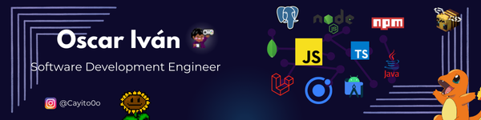

    <h1 style="font-size: 32px">
        
        Hi there!, how are you!?
    </h1>

  

Lenguages 📔

  
  
  
  
  
  

Database 💾

  
  
  

Frameworks 🔧

  
  

Tools ⚙️

  
  

Designed tools 🖌️

  
  

IDEs/Editors 💻

  
  
  

