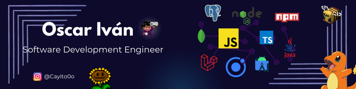

    <h1 style="font-size: 32px">
        
        Hi there!, how are you!?
    </h1>

  

<h3 align="center">Lenguages 📔</h3>

  
  
  
  
  
  
  
  
  
    

<h3 align="center">Database 💾</h3>

  
  
  

<h3 align="center">Frameworks 🔧</h3>

  
  
  
  
  

<h3 align="center">Tools ⚙️</h3>

  
  

<h3 align="center">Designed tools 🖌️</h3>

  
  

<h3 align="center">IDEs/Editors 💻</h3>

  
  
  
  
  
  

<h3 align="center">GitHub Stats 📊</h3>

  
    

  

---

<h2 align="center">📈 Activity Graph</h2>

  

---

<h3 align="center">Random Dev Quote ✍️</h3>

  

---

<h3 align="center">Connect With Me 🌐</h3>

  

  

  

